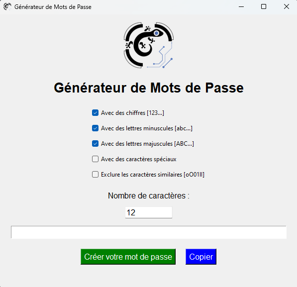

  

# Générateur de Mots de Passe 🔐

Ce projet est un outil interactif permettant de générer des mots de passe sécurisés en quelques clics. Grâce à une interface conviviale, vous pouvez personnaliser les mots de passe selon vos besoins (chiffres, lettres, caractères spéciaux) et exclure les caractères ambigus.

## Fonctionnalités :
- **Personnalisation :** Ajoutez ou excluez des chiffres, lettres ou caractères spéciaux.
- **Exclusion des caractères ambigus :** Améliore la lisibilité (par ex. : "o", "O", "0", "l", "I").
- **Copie facile :** Copiez le mot de passe généré directement dans votre presse-papier.
- **Interface intuitive :** Simple à utiliser pour tous les utilisateurs.

## Installation :
1. Clonez ou téléchargez ce dépôt.
2. Exécutez le fichier `.exe` ou lancez `password_generator.py` avec Python.

## Précautions :
Cet outil est conçu pour une utilisation légitime, comme protéger vos comptes personnels ou d'entreprise. N'utilisez pas ce logiciel à des fins illégales.

  

